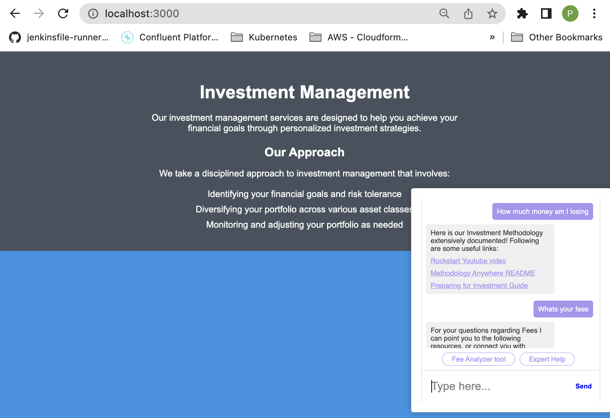

This repo will show how a ML model can be exposed as an API and integrated with a custom open source website having a custom open source chat bot using botkit.You can use any kind of website and chatbot. The idea is that the Front end (chatbot in this case) will make http calls to a REST API for a Machine learning Model predicting classification for a certain text.
The uses of such architecture are several from using this kind of architecture to cross-selling/upselling products to sentiment analysis to predicting customer churn, leaving your back office operations to handle more urgent matters as a company.

If you want to understand what kind of classifications the provided  model performs, take a look at sample_custom_model/data_combined.csv
There is some sample data that I have added, so readers can understand that teh classification model will essentially return classifications for teh strings sent as "Investment Advice", "Close their Account" , "Functionality", "Fees"
In the front end or bot you can then have different branches of logic based on the predictions returned by the REST API fronting the Machine learning model.

Training the ml model is out of scope for this repo.
I have included a pretrained classification model in sample_custom_model/logistic_regression.pkl
To understand how this classification model has been built you can go through teh logic in sample_custom_model/logisticregressionmodel_save.py file
If you have to create your own classification model, use your own data sets in a format similiar to sample_custom_model/data_combined.csv and then run the logisticregressionmodel_save.py and create a new "pkl" file like sample_custom_model/logistic_regression.pkl

Now assuming that you already have a serialized model as a "pkl" file, lets go over the steps for putting this model in a sagemaker compatible Docker container, testing the model locally in the Sagemaker compatible Docker container, deploying the Docker container onto Sagemaker , building an inferencing endpoint in AWS , exposing the inferencing endpoint as an API and custom building a static website with a chatbot which will use this REST API to make routing decisions and expose content to end users.

   ---------------
 
Step 1:  
Creating a sagemaker compatible Docker Container and running the container locally. 
I performed the below steps on AWS Cloud9 environment. You can do these steps on your own local workstation as well.
Once you git clone this repo in Cloud9, you will need to go to ml_project/container for rest of the steps.

`cd /home/ec2-user/environment/model_chatbot_new/ml_project/container` 
`chmod +x logisticregression_analysis/serve` 
`docker build -t logisticregression_analysis_docker_image .`  
To push the local docker image to AWS ECR run the below command  
`sh build_and_push.sh logisticregression_analysis_docker_image`

Step 2:  
To test the local docker image "locally" on your Cloud9 instance do the following steps . The folder that has the code for local testing is in ml_project/local_test folder.

<code>
cd ../  
cd local_test  
chmod +x serve_local.sh  
./serve_local.sh logisticregression_analysis_docker_image:latest  
</code> 

Next to do predictions execute the following. Take a look inside input.json to understand the json text that you send in to get teh prediction from the classification model 
<code>./predict.sh input.json</code>

Step 3: 
Now prepare the model "pkl" file, so that it can be deployed on Sagemaker. for this you ened to prepare a tar.gz file of the ".pkl" file.
<code>cd test_dir/model  
tar -zcvf logistic_regression.tar.gz logistic_regression.pkl  
</code>

Step 4:  
Here Sagemaker details for deploying the model onto AWS sagemaker from teh console
 - Upload the model to S3 bucket as follows by creatinga bucket say logistic-regression-xxxxx
    aws s3 cp logistic_regression_xcel.tar.gz s3://logistic-regression-xxxxx
 - Set up model using the AWS Console name it as logistic-demo
    - Refer to the ECR image that was uploaded and the s3 object ending in tar.gz
 - Set the Inference / Endpoint Configuration name :logistic-demo-endpointconfig
 - Set the Inference / End point name : logistic-demo-endpoint

Step 5: 
for testing the sagemaker endpoint from Cloud9 execute the following command  
<code>aws sagemaker-runtime invoke-endpoint \
--endpoint-name logistic-demo-endpoint \
--body '{"input": "this account is more passive than my other accounts"}' \
--content-type 'application/json' \
  prediction_response.json
  </code>

Step 6: 
To create a REST API endpoint so that this model can be invoked as an HTTP endpoint , here are some easy steps.
We will use chalice an open source framework which will create the REST API for the sagemaker model endpoint.
chalice will create a API Gaeway endpoint and a backing lambda function calling the sagemaker endpoint.
The lambda function code is in api_creation_chalice/app.py

<code>
cd ../api_creation_chalice/
</code>

Change EndpointName='logistic-demo-endpoint' in app.py corresponding to the name you used above while setting up teh sagemaker inferencing endpoint.
<code>
pip3 install chalice 
chalice new-project logisticregression-analysis-api 
cd logisticregression-analysis-api/ 
rm app.py requirements.txt  
cp ../app.py ../requirements.txt ./ 
pip3 install boto3 
</code>
  
Create a custom Lambda execution role which can be assumed by the Lambda function that will be created by chalice. 
Open the config.json inside the .chalice folder and add the following lines 
  <code>
     "iam_role_arn": "arn:aws:iam::xxxxx:role/Lambdacustomrole", 
      "manage_iam_role": false, 
  </code>

  From the root of logisticregression-analysis-api folder , do the following  
  <code>chalice deploy</code>
  
  Make a note of the name of Lambda ARN and the REST API URL after deploy is succesful
  - Lambda ARN: arn:aws:lambda:us-east-1:xxxxx:function:logisticregression-analysis-api-dev
  - Rest API URL: https://abcdef.execute-api.us-east-1.amazonaws.com/api/

Next go to homegrown_website_and_bot folder  
Change the API end point in homegrown_website_and_bot/features/sample_echo.js  
Static website file : homegrown_website_and_bot/public/index.html  
Run `npm install`  
Run `node bot.js` 

When all is said and done, This is how it should look

